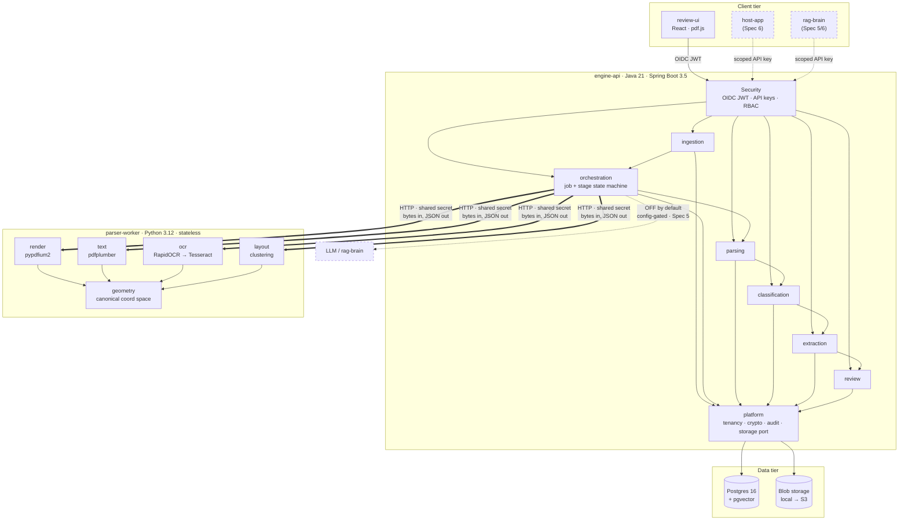
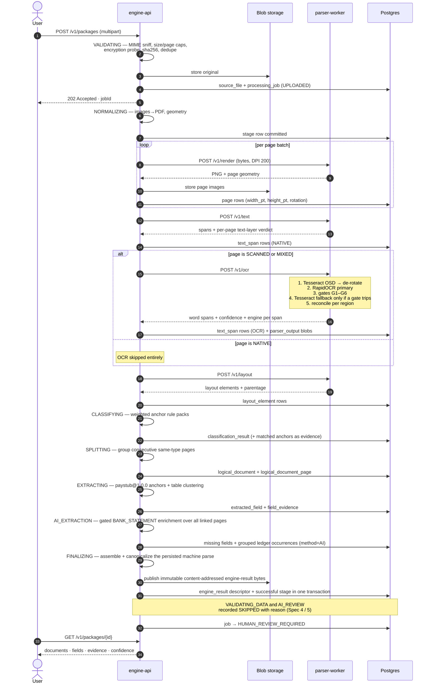
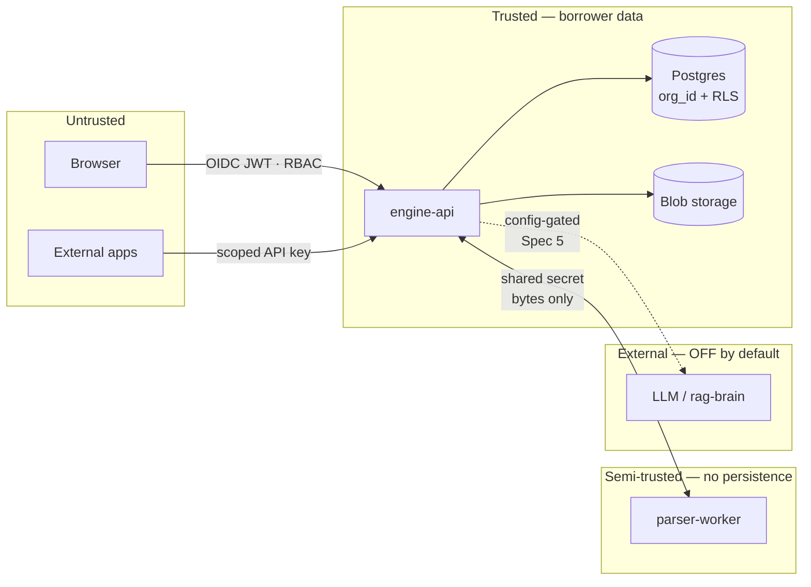
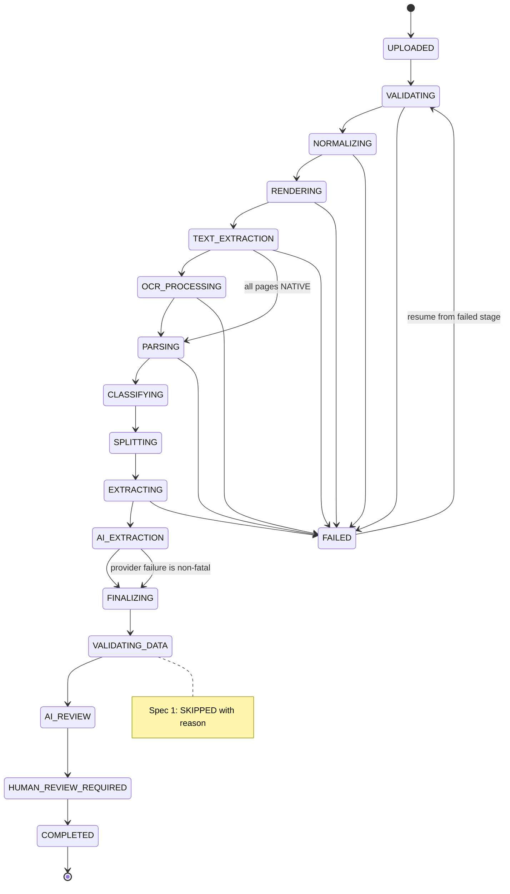
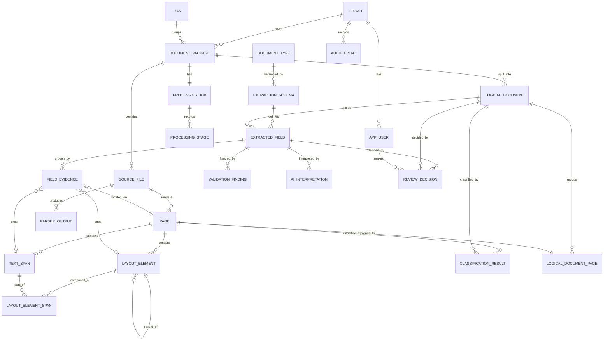
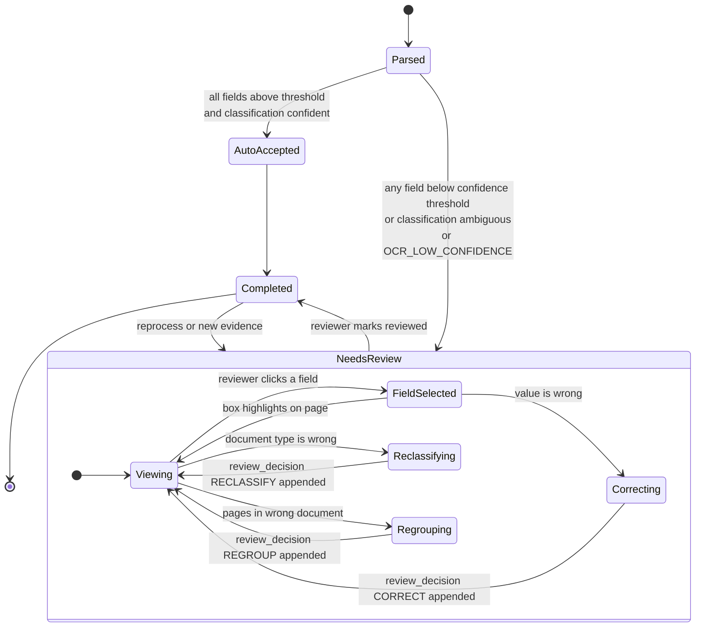

# Architecture — Pragmatic DS Document Engine

**Status:** As-built through Phase 0B · 2026-08-15
**Source spec:** [`docs/superpowers/specs/2026-07-30-parse-and-evidence-core-design.md`](superpowers/specs/2026-07-30-parse-and-evidence-core-design.md)

---

## 1. System overview

The Pragmatic DS Document Engine ingests mortgage loan packages, separates them into logical documents,
extracts structured data, and **attaches page-and-coordinate-level source evidence to every value it
produces.**

It exists because nothing else in this product stack can answer *"where on the page did that number come
from?"* — `host-app` classifies and stores whole files, `rag-brain` reasons over document text, but
neither produces page images, bounding boxes, or field-level evidence.

The engine is deliberately **not** a general-purpose PDF parser. It is a mortgage document
intelligence platform whose output feeds three consumers.

```
                     ┌──────────────────────────┐
                     │  Pragmatic DS Document Engine    │
                     │                          │
                     │  Ingestion               │
                     │  Parsing / OCR / Layout  │
                     │  Classification & Split  │
                     │  Field Extraction        │
                     │  Validation              │
                     │  Audit Trail             │
                     │  Review UI               │
                     └────────────┬─────────────┘
                                  │
                    Structured JSON + Evidence
                                  │
              ┌───────────────────┼───────────────────┐
              ▼                   ▼                   ▼
        the host app            RAG Brain           Other Apps
        (LOS / DMS)          (pgvector)
```

### Guiding principle

> Every extracted value must be traceable back to the exact source page and location it came from.

Where traceability conflicts with speed, simplicity, or cleverness, traceability wins. Section 6
describes the mechanism.

## 2. Major services

| Service | Stack | Owns | Does not have |
|---|---|---|---|
| `engine-api` | Java 21 · Spring Boot 3.5 · Gradle | Database, all processing state, orchestration, auth, tenancy, audit, storage | — |
| `parser-worker` | Python 3.12 · FastAPI | Nothing. Pure stage functions | Database access · storage credentials · persistence · borrower context |
| `review-ui` | React · TypeScript · Vite · Tailwind · pdf.js | Presentation only | Business logic |
| `postgres` | Postgres 16 + pgvector | Single Flyway-owned schema | — |

### 2.1 `engine-api` module boundaries

Each Gradle module has one purpose and a defined interface.

| Module | Purpose | Depends on |
|---|---|---|
| `platform` | Tenancy, security, crypto, error model, audit, `BlobStoragePort`, PII masking | — |
| `ingestion` | Upload, validation, hashing, dedupe, normalization | `platform` |
| `orchestration` | Job/stage state machine, retry, resume, `ParserPort` | `platform` |
| `parsing` | Pages, text spans, layout elements, parser-output persistence | `platform` |
| `classification` | Rule packs, page classification, splitting | `platform`, `parsing` |
| `extraction` | Extraction schemas, field extraction, evidence chains | `platform`, `parsing`, `classification` |
| `results` | Canonical machine-envelope assembly, immutable descriptors, finalization, current/history reads | `platform`, `ingestion`, `orchestration`, `parsing`, `classification`, `extraction` |
| `review` | Review decisions, corrections, audit projection | `platform`, `extraction` |
| `app` | Boot entry point, security wiring, Flyway, OpenAPI | all |

**Mortgage domain rules live only in `classification` and `extraction`.** They never reach the Python
worker, which knows about pixels, glyphs, and boxes — and nothing about mortgages.

### 2.2 `parser-worker` structure

`render/` · `text/` · `ocr/` · `layout/` · `geometry/` (the canonical coordinate space) · `api/`

## 3. System architecture



## 4. Processing sequence



## 5. Data flow

```
PDF bytes
   │
   ├─▶ original blob ─────────────────────────────────▶ [immutable, retained per policy]
   │
   ├─▶ normalized PDF ───────────────────────────────▶ [blob]
   │
   ├─▶ page images (PNG @ 200 DPI) ──────────────────▶ [blob]
   │
   └─▶ raw stage output ─────────────────────────────▶ parser_output [blob + sha256]
                │
                ▼
        text_span (boxes, PDF points, top-left, rotation-0, engine per span)
                │
                ├──▶ layout_element ──▶ layout_element_span
                │
                ├──▶ classification_result ──▶ logical_document
                │
                └──▶ extracted_field ──▶ field_evidence ──▶ page ──▶ source_file ──▶ bytes
                          │
                          ├── ai_interpretation   (separate, append-only, never auto-merged)
                          └── review_decision     (separate, append-only)
                │
                └─▶ FINALIZING ──▶ canonical machine envelope [immutable blob]
                                      └─▶ engine_result [append-only descriptor + revision chain]
```

The **effective value** of a field is derived from these four layers at read time. It is never stored
a second time, which is what keeps *"what did the parser originally say?"* permanently answerable.

## 6. The evidence mechanism

### 6.1 Canonical coordinate space

**All boxes are stored in PDF points, top-left origin, at rotation-0.** `page` carries `width_pt`,
`height_pt`, `rotation`, and `detected_rotation`.

This is the single most consequential decision in the system. Image pixels would become silently
wrong the instant render DPI changed — every stored evidence box corrupt, with no error raised.

The three input sources disagree and are normalized at the worker boundary:

| Source | Native space | Conversion |
|---|---|---|
| pdfminer / pdfplumber | bottom-left origin, points | pdfplumber `top`, verified against `height_pt` |
| pypdfium2 render | top-left, pixels at render DPI | `pt = px × 72 ÷ dpi` |
| RapidOCR / Tesseract | top-left, pixels of input raster | `pt = px × 72 ÷ dpi`, then un-rotate by OSD angle |

Coordinate drift is how evidence systems quietly begin to lie. The conversion has a dedicated test
against a fixture whose ground-truth boxes are known by construction.

### 6.2 Evidence roles

Every `field_evidence` row carries a role: `VALUE`, `LABEL`, or `CONTEXT`.

The label anchor is evidence too. `$48,231.30` alone proves nothing — *"YTD Gross"* sitting to its
left is the entire reason it was read as year-to-date gross pay. A reviewer needs to see both.

### 6.3 Denormalized boxes

`field_evidence` stores its bounding box directly, not only by reference. A reparse regenerates
layout elements and spans; **the box a human already reviewed must not move underneath them.**

## 7. Trust boundaries



| Boundary | Control |
|---|---|
| Browser → API | OIDC JWT, RBAC (`ADMIN` / `PROCESSOR` / `REVIEWER` / `READONLY`), per-document authorization |
| External app → API | Scoped machine API key on a dedicated filter chain; scopes only, never roles |
| API → worker | Private network, shared-secret header, bytes only. Worker holds no credentials, persists nothing, logs no document content |
| API → Postgres | `org_id` on every row, Hibernate `@TenantId`, Postgres RLS fail-closed, GUC stamped at connection acquisition |
| API → blob storage | Server-side encryption, short-TTL signed URLs, per-object authorization check before URL issuance |
| API → LLM | **Disabled by default.** Config-gated, explicit per-tenant opt-in, Spec 5 |

The local dev profile auto-authenticates as a fixed dev ADMIN, mirroring host-app's
`LocalDevSecurityConfig` — and carries the same explicit warning against ever deploying it.

## 8. Technology recommendations

### Chosen

| Layer | Choice | Why |
|---|---|---|
| API | Java 21, Spring Boot 3.5, Gradle | Matches host-app and rag-brain — one runtime, one build system, transferable patterns |
| Persistence | Postgres 16 + pgvector, Flyway | pgvector enabled at `V1` so Spec 6 RAG indexing needs no extension migration |
| ORM | Spring Data JPA / Hibernate (Apache-2.0 election) | `@TenantId` gives the same tenancy enforcement already proven in host-app |
| Worker | Python 3.12, FastAPI | The document-CV ecosystem is Python. FastAPI gives typed contracts and OpenAPI for free |
| Render | pypdfium2 | Apache-2.0/BSD-3, prebuilt arm64 wheels, no system binary, faster than poppler |
| Native text | pdfplumber / pdfminer.six | MIT, word-level boxes, plus `rects`/`lines` as table and checkbox hints |
| PDF ops | pypdf | BSD-3, normalization, encryption probe, page ops |
| OCR primary | RapidOCR (PP-OCR on ONNX Runtime) | Apache-2.0, PaddleOCR model lineage at ~100 MB, native arm64 |
| OCR fallback + OSD | Tesseract 5 | Apache-2.0, orientation detection RapidOCR lacks, robust last resort |
| Image ops | opencv-python-headless, Pillow, NumPy | Deskew, adaptive binarization, blank detection |
| Frontend | React, TypeScript, Vite, Tailwind, pdf.js | Matches host-app-web; pdf.js is Apache-2.0 |

### Alternatives considered and rejected

| Rejected | Reason |
|---|---|
| **PyMuPDF** | AGPL-3.0 — source-disclosure obligation incompatible with an Apache-2.0 open-source engine |
| **pdf2image + poppler** | poppler is GPL-2 |
| **Surya, Marker** | GPL-3.0 — hard blocker under a permissive engine |
| **PaddleOCR (MVP)** | Licence is fine (Apache-2.0). No linux `aarch64` wheels on PyPI → QEMU emulation or source build on Apple Silicon, ~3 GB image. **Retained as a native/GPU adapter for AWS** |
| **Docling (MVP)** | MIT and it *does* preserve bounding boxes. Excluded from MVP only because its end-to-end pipeline runs its own OCR and layout, fighting stage-level resume and coarsening golden-file diffs. **Strong production candidate behind `LayoutEngine`** |
| **LayoutParser** | Detectron2 build complexity out of proportion to MVP value |
| **Camelot / Tabula** | Ghostscript and JVM dependencies; Camelot needs *ruled* tables, and paystub grids often are not |
| **Table Transformer** | GPU-bound. Roadmapped behind `LayoutEngine` |
| **Postgres job queue (worker polls)** | Would give Python write access to the borrower database and end the worker's status as a replaceable pure function |
| **Redis / RabbitMQ in MVP** | An extra container and queue semantics to debug before a single page parses correctly |
| **host-app module instead of a repo** | Would make the suite a dependency of every consumer |

## 9. Scaling strategy

| Stage | Now (local) | Next (AWS) |
|---|---|---|
| Dispatch | In-process executor over stage rows | SQS in front of the same dispatcher — **no worker change** |
| Worker | 1 container | N stateless containers behind a load balancer; GPU task group for `PaddleOcrEngine` |
| Storage | Local filesystem adapter | S3 via the existing `BlobStoragePort` |
| Database | Docker Postgres | RDS Postgres, read replica for review traffic |
| Page images | Local blobs | S3 + CloudFront signed URLs |
| Observability | Structured stdout | CloudWatch, metrics per stage |

The stateless worker is the whole scaling story: it holds no session, no cache, and no state, so it
scales horizontally by replica count. `text_span` is the volume table — roughly 30k–70k rows per
75-page package — so it uses a `bigint` key and stays partition-ready by `created_at`.

Cost control: OCR is the expensive stage, which is why `NATIVE` pages skip it entirely and fallback
runs only when a gate trips rather than on every page.

## 10. Failure and retry strategy

Every stage is a row carrying attempt count, timing, parser versions, output digest, and a **PII-free
error code**. Resume replays only from the first failed stage forward — completed stages never rerun.



### Rules

1. **A stage failure never fails silently.** The `processing_stage` row commits with its error code
   *before* the exception propagates.
2. **Worker calls are bounded and retried** with exponential backoff and jitter. Exhausted retries
   mark the stage `FAILED`, resumable without rerunning earlier stages.
3. **A page failure is not a package failure.** A page that fails OCR is marked with its error, the
   job continues, and the package routes to `HUMAN_REVIEW_REQUIRED`.
4. **A missing field is a normal outcome**, not an error. The row exists with
   `validation_status = MANUAL_REVIEW_REQUIRED` and no evidence attached.
5. **Idempotency.** `processing_job.idempotency_key` is unique per org; a replayed submit returns the
   existing job rather than duplicating work.
6. **Bad OCR never silently completes a package.** If both engines trip gates, the page is
   `OCR_LOW_CONFIDENCE` and a human is required.

### Error taxonomy (PII-free)

| Class | Examples |
|---|---|
| `INGEST_*` | `UNSUPPORTED_MIME`, `FILE_TOO_LARGE`, `PAGE_LIMIT_EXCEEDED`, `PASSWORD_PROTECTED`, `CORRUPT_PDF`, `CORRUPT_IMAGE`, `DUPLICATE_FILE` |
| `PARSE_*` | `RENDER_FAILED`, `TEXT_EXTRACTION_FAILED`, `OCR_FAILED`, `OCR_LOW_CONFIDENCE`, `WORKER_UNAVAILABLE`, `WORKER_TIMEOUT` |
| `CLASSIFY_*` | `NO_RULE_PACK`, `AMBIGUOUS`, `BELOW_THRESHOLD` |
| `EXTRACT_*` | `SCHEMA_NOT_FOUND`, `FIELD_NOT_FOUND`, `NORMALIZATION_FAILED`, `LOW_CONFIDENCE` |
| `AUTH_*` | `FORBIDDEN_TENANT`, `FORBIDDEN_DOCUMENT`, `SCOPE_DENIED` |

Error messages carry a stable code plus non-sensitive parameters. **Never document content.**

## 11. Data model relationships



Full field-level definitions are in [`DATA_MODEL.md`](DATA_MODEL.md).

## 12. Human-review workflow



### What a reviewer sees

| Left pane | Right pane |
|---|---|
| pdf.js viewer, page images, evidence-box overlay | Logical documents with type and classification confidence |
| Selected field's box highlighted in place | Extracted fields with value, displayed text, confidence indicator |
| Page thumbnails with type badges | Validation warnings (Spec 4) |
| | Original value → corrected value → user → timestamp |
| | Processing status and stage-level error detail |

### Correction is append-only

A correction writes a `review_decision` row. It **never** overwrites `extracted_field` in place. The
parser's original answer, the deterministic normalization, any LLM interpretation, and the human
decision remain four separately readable layers forever.

This is what makes the audit trail defensible rather than decorative.

### A correction survives re-extraction

`review_decision.subject_id` names an `extracted_field` row id, and every path that re-reads a
package replaces those rows: the EXTRACTING stage deletes and recreates a package's fields, and the
AI stage deletes a NONE-method occurrence before inserting the value it read. A decision left
pointing at a destroyed row stops resolving, and the machine's reading silently returns in place of
the human's — with no error anywhere.

The **stable identity of a field across re-extractions** is therefore not its row id but its
*coordinate*: `(logical_document_id, field_name, group_key)` — exactly the tuple Postgres already
enforces as unique among a document's current rows (`extracted_field_one_current`). Because the
database guarantees that tuple is unique per generation, a coordinate can never ambiguously match
two occurrences, so a correction on "property B" cannot land on property A.

`ReviewCarryForwardPlanner` applies the coordinate rule; `ReviewCarryForward` is the one component
both replacement paths call. What survives, and what deliberately does not:

| Before the re-run | Reading unchanged | Reading changed (different value or schema version) |
|---|---|---|
| CORRECT | carried | carried, and escalated to `MANUAL_REVIEW_REQUIRED` |
| REJECT | carried | carried, and escalated to `MANUAL_REVIEW_REQUIRED` |
| CONFIRM | carried | **dropped** — agreement was with one specific value |
| coordinate missing, moved to another document, or ambiguous | **nothing carried** | **nothing carried** |

A carried correction is itself an **append**: a new `review_decision` naming the replacement row,
credited to the original human, with `reason` naming the decision it was carried from. Nothing is
rewritten, and a dropped carry loses nothing from the record — the decision stays in the
append-only table, it simply stops being the effective value.

The asymmetry is deliberate and follows the house rule that **a wrong value is worse than a missing
one**. A correction is a statement about the *document*, which did not change, so it outlives a
re-read; a confirmation is agreement with a *value*, so it does not. Where the engine cannot
re-attach with confidence it carries nothing rather than guessing onto a row.

## 13. Future integration points

### Artifact boundaries after V15

Five superficially similar outputs have deliberately different owners and lifecycles:

| Artifact | Owner | Mutability | Current status |
|---|---|---|---|
| Machine engine result | Document Engine | Append-only per parse generation | **Implemented.** Exact canonical parser output and evidence; no correction overlay |
| Effective reviewed view (`/export`) | Document Engine | Mutable read-time projection | **Implemented.** Current human corrections can change it without a reparse |
| Reviewed-result snapshot/overlay | Document Engine | Immutable snapshot | **Future.** One engine-result revision plus a pinned set of human decisions; not implemented by `/export` |
| Instance release | RAG Brain | Immutable promoted configuration | **Future.** Folder-specific instructions, corpus, model, tools, and output contract |
| Analysis run | RAG Brain | Append-only | **Future.** One instance release analyzing one exact engine-result revision |

The first Suite/Lab prototype must create **one package per stored original document**. Deleting
that package tombstones the original and every parsed-result endpoint immediately; retention later
purges both. Results are reusable only within their current package—matching bytes in another
package do not authorize a cache hit. The current API also assumes one processing job per package;
a future new-job reparse requires an authoritative current-job pointer or database invariant.

| Consumer | Integration | Spec |
|---|---|---|
| **host-app** | New `DocumentParsePort` mirroring the existing `FolderBrainPort` pattern; one stored original maps to one package and one current immutable result | 6 |
| **rag-brain** | A future service principal reads a pinned engine-result revision, then an immutable instance release produces an append-only analysis run | 5/6 |
| **RAG indexing** | `document_chunk` table with `embedding vector(1536)`; pgvector already enabled at `V1`. Chunks carry page and box references so a RAG citation resolves to a highlight | 6 |
| **Other apps** | Authenticated metadata plus ADMIN-only exact engine-result content in the prototype; scoped machine identity is a production gate | 6 |

The `AiInterpretationPort` uses a **stub adapter** in Spec 1 — deterministic, no network, no LLM. The
port exists so Spec 5 is a wiring change rather than a redesign.

## 14. Security considerations

### Implemented controls

As of Phase 7 (complete). This list means *shipped and covered by a test* — nothing aspirational.

`org_id` on every row with Postgres RLS, fail-closed, structurally enforced by `RlsCoverageIT` ·
migrations proven to apply as a non-superuser owner (`MigrationOwnershipIT`), which is what keeps
RLS from being silently bypassed · **RLS engaged at runtime**: the app datasource is wrapped so
every pooled connection is stamped with the caller's `app.current_org`, proven to block
cross-tenant reads as a non-owner role and proven not to leak the GUC across pooled connections
(`RlsRuntimeIT`) · **boot-time datasource-role assertion** that refuses to start outside
`local`/`test` if the role is a superuser or the schema owner (`DatasourceOwnershipCheck`,
`RlsRuntimeIT`) — the enforcement half of risk R2 · **authentication**: an OIDC JWT resource-server
chain resolves the `org_id` claim and the `app_user` row to a principal outside `local`/`test`, and
a header-driven dev principal inside them (`JwtAuthPrincipalConverterTest`, `JwtSecurityIT`);
unauthenticated `/v1` is 401, health/OpenAPI stay public · **RBAC**: a single central role matrix
(READONLY ⊂ PROCESSOR ⊂ REVIEWER ⊂ ADMIN) on the security chain (`RbacAndCrossTenantIT`) ·
**per-subject access**: cross-tenant ids answer 404 (never 403) via `findByIdAndOrgId` behind
`DocumentAccessGuard` (`RbacAndCrossTenantIT`) · **append-only corrections with an audit trail**:
a field correction writes a Layer-4 `review_decision` and never overwrites the machine's Layer-2
value, the effective value is derived at read time, and the original stays permanently readable
(`FieldCorrectionIT`, mutation-checked) · **server-side PII masking at the serializer layer**:
value-bearing response fields are `MaskableValue`, masked by a global Jackson serializer when the
field is sensitive, with an ArchUnit rule that makes a response DTO *structurally unable* to emit
an unmasked value (`ResponseMaskingIT`, `ResponseDtoMaskingArchTest`) · **app-issued signed
download URLs**: short-TTL HMAC tokens binding the object, its type, and its org, verified
MAC-first in constant time, rejecting expired/forged/cross-org tokens (`SignedUrlServiceTest`, the
signed-download ITs) · **soft delete + scheduled retention purge** that removes the DB rows, the
blobs, AND the PII-bearing `review_decision` rows while keeping the immutable `audit_event` trail
(`RetentionPurgeIT`, mutation-checked); a tombstoned package reads and writes as 404 everywhere
(`TombstonedPackageAccessIT`) · **audit trail**: append-only `audit_event` on correction, review,
export, purge, and signed-URL issuance, actor from the authenticated principal, metadata PII-free,
client IP stored as a KEYED HMAC (never a reversible digest) or not at all · structured logging
with a PII-free error taxonomy (`ErrorCode` plus a `DomainException` params contract of sizes and
counts only, `server.error.include-message: never`, SQL parameter logging off), proven by a
log-capture test that no borrower value reaches the logs (`LogPiiLeakIT`) · worker persists
nothing, holds no credentials, and logs no document content · LLM egress disabled by default (no
LLM adapter is wired at all) · malware-scan integration point (no-op adapter, status `SKIPPED`) ·
CI secret scanning (gitleaks) · CI licence gate across all three ecosystems · fixture provenance
enforcement — no real borrower document can enter the repository · **immutable machine results**:
V15 descriptors are append-only and tenant-bound with FORCE RLS; V16 also constrains every storage
key to the descriptor tenant and digest. Results are backed by atomic content-addressed blob
publication, verified by derived key, SHA-256, and byte length before every content read, hidden
immediately by package tombstone, and included in retention purge; exact current/historical bytes
require ADMIN and create a value-free access audit event.

### Requires deployment configuration or a later spec

Named here with what remains, so *Implemented controls* stays honest.

| Control | Status |
|---|---|
| Encryption in transit and at rest | Deployment (TLS termination, encrypted storage/RDS) — not a code control |
| A live OIDC identity provider | Deployment: the JWT resource-server chain is built and tested with locally-minted tokens; a real issuer/JWKS is wired via config outside `local`/`test` |
| A non-owner runtime datasource role (so RLS actually engages) | Deployment: enforced by the boot assertion outside `local`/`test`; local dev intentionally runs as owner with `@TenantId` isolating and the assertion warn-only |
| Fine-grained per-document access grants *beyond* tenant membership | Future spec: the `DocumentAccessGuard` seam exists; today it enforces org membership |
| A signed-URL / audit-IP / worker secret per environment | Deployment: fail-closed when unset (no reversible hash, no unsigned URL) |
| Retention-policy authoring UI and per-document-class schedules | Future: the `retention_policy` table + a default-days config drive the purge today |
| RAG Brain service-principal/scoped result access | Future: raw engine-result content is ADMIN-only today; do not give RAG Brain a generic user token |
| Frozen parser/instance releases | Future: current provenance records only what is durably knowable; it is not a promoted behavior-release contract |
| Crash-safe external blob deletion | Future: durable deletion outbox, reconciliation worker/janitor, and claimed-row admission for original, page, and result blobs |

Phase 6's review UI also masks sensitive values in the browser — defence in depth on top of the
server-side serializer, no longer the only line.

### Explicitly not claimed

**This system is not certified or compliant with GLBA, SOC 2, HIPAA, or any other standard.**
Security features are not compliance. Having controls is not the same as having evidence that
controls operate effectively over a period, which is what an audit tests.

### Controls a formal compliance program would additionally require

| Area | Requirement |
|---|---|
| Governance | Written information security program, designated security officer, board-level reporting |
| Risk | Documented risk assessment, annual review, risk register |
| Vendor management | Third-party due diligence, contractual safeguards, ongoing monitoring — including every OCR/LLM provider |
| Change management | Documented SDLC, peer review evidence, segregation of duties, change approval records |
| Access | Periodic access reviews, joiner/mover/leaver process, privileged access management |
| Key management | Documented rotation policy, KMS with audited key access, defined key custodians |
| Monitoring | SIEM, alerting, log integrity protection, defined retention |
| Testing | Independent penetration test, vulnerability scanning cadence, remediation SLAs |
| Incident response | Written IR plan, tested, with breach-notification procedures |
| Resilience | BCP and DR plan with tested RTO/RPO |
| Evidence | Continuous control evidence collection over an audit period — not a point-in-time snapshot |
| Privacy | Data inventory, retention schedule, consumer rights handling, GLBA privacy notices |

## 15. Licensing

The engine is intended for release under **Apache-2.0** with domain-specific rule packs and
extraction schemas remaining private. See [`LICENSING.md`](LICENSING.md) for the allowlist, the three
documented licence elections (Temurin JDK GPLv2+CE, Hibernate Apache-2.0, FreeType FTL), and the CI
enforcement that prevents a copyleft dependency arriving through a transitive upgrade.
